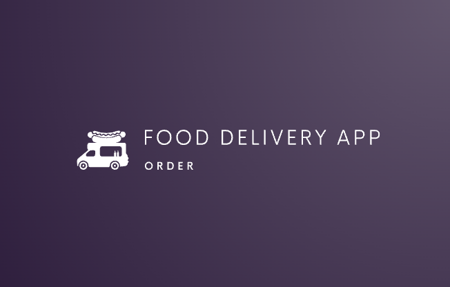

# Food Delivery App

## Overview

Food Delivery App is a responsive web application that allows users to order food from various restaurants. The app features a basic landing page with a dynamic menu, categorized items, and the ability to set items as favorites and add them to the cart. The project is built using React, Firebase, Redux, and Material-UI for a seamless user experience.

## Features

- Dynamic Menu: Users can browse through a variety of food items dynamically rendered based on categories.
- Category Navigation: Easily navigate through different food categories to find desired items.
- Favorites: Users can mark their favorite food items and access them quickly.
- Cart Functionality: Add food items to the cart and modify quantities
- Responsive Design: The app is fully responsive to provide an optimal user experience on various devices.

## Technologies Used

- React
- Firebase (Authentication, Firestore)
- Redux (State Management)
- Material-UI (UI Components and Styling)
